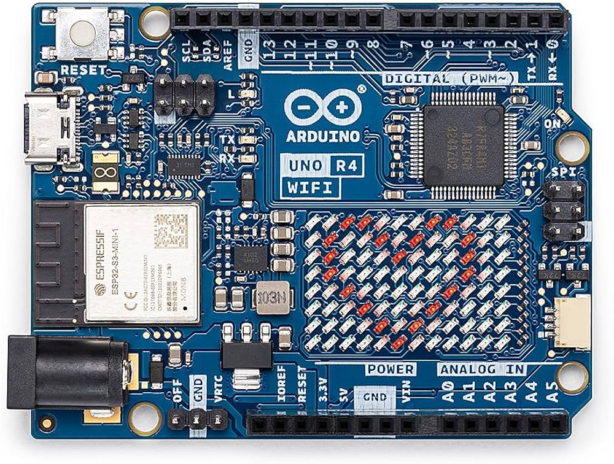
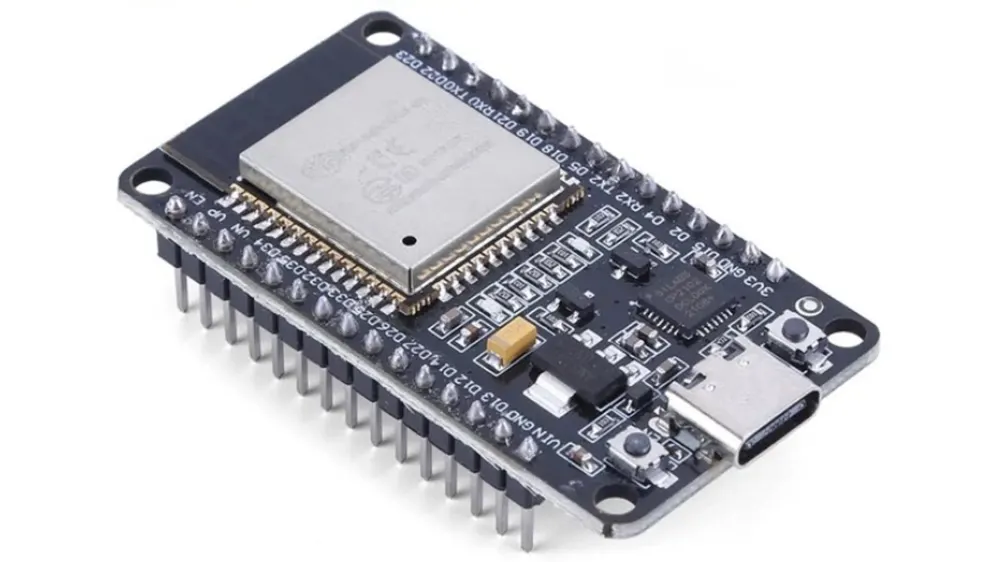

# IoT Project: Speed Camera and Remote-Controlled Car

This project consists of a small remote-controlled car and a scaled-down speed camera system.  
The car is controlled through gyroscope-based gestures and communicates wirelessly with the rest of the system.  
When the car passes through the speed camera, its speed is measured and compared against a predefined limit (0.75m/s right now).  
A status LED turns green if the vehicle is within the limit and red if the limit is exceeded.  
The measured data is then sent to a web server in JSON format, where it is stored and displayed for later analysis.

## Table of contents
* [Hardware and software requirements](#hardware-and-software-requirements)
* [Project layout](#project-layout)
* [Pin mapping](#pin-mapping)
* [User guide](#user-guide)
* [Links](#links)
* [Team members](#team-members-and-contributions)

## Hardware and software requirements

### Hardware requirements

For the car:
- ARDUINO UNO R4 WIFI

- x2 nRF24L01+ PA LNA SMA Antenna 2,4 GHz
- x2 NRF adapter
- Power Bank 10400 mA 5V-2.1A
- L298N Motor Driver
- x2 Battery pack 3V
- x4 5V Motors 
- x4 Tires
- Chassis 
- Power Bank 5000mA
- AZDelivery AZ-Nano V3-Board
- AZDelivery AZ-Nano V3-Board case
- MPU 6050 support 
- Straps
- Adhesive tape
- 5 volt benchtop generator
- Stagnator
- USB-C cables
- Screws
- Bolts \

For the speed camera:
- ESP32

- Breadboard and jumper wires
- x2 VCNL4010

### Software requirements
The firmware is built with **Arduino IDE 2.x** (board packages for ESP32, Arduino Uno R4 WiFi and Arduino Nano).  
Key libraries: **RF24**, **MPU6050**, **I2Cdev**, **IRremote**.

The web server runs on **Node.js**. Install dependencies in the `src/` folder with:

```bash
npm install
npm start
```

The web dashboard is deployed online on Render and can be accessed at [iot-project-group-14.onrender.com](https://iot-project-group-14.onrender.com/).  
The dashboard displays speed logs and system data collected by the project.

## Pin Mapping

### Adapter nRF24L01 (SPI) → Arduino Uno R4

| Adapter Pin | Arduino Uno R4 Pin        |
|-------------|---------------------------|
| VCC         | 5V                        |
| GND         | GND                       |
| CE          | Digital 7                 |
| CSN         | Digital 8                 |
| SCK         | Digital 13 (SPI)          |
| MOSI        | Digital 11 (SPI)          |
| MISO        | Digital 12 (SPI)          |

### L298N Motor Driver → Arduino Uno R4

| L298N Pin | Arduino Uno R4 Pin |
|-----------|--------------------|
| ENA       | Digital 5          |
| IN1       | Digital 9          |
| IN2       | Digital 10         |
| ENB       | Digital 6          |
| IN3       | Digital 2          |
| IN4       | Digital 4          |
| 12V       | 12V Battery (+)    |
| GND       | GND Battery & Arduino |

**Motor connections:**  
OUT1, OUT2, OUT3, OUT4 → motor terminals

### MPU6050 (I2C) → Arduino Nano

| MPU6050 Pin | Arduino Nano Pin   |
|-------------|--------------------|
| VCC         | 3.3V               |
| GND         | GND                |
| SCL         | A5 (I2C)           |
| SDA         | A4 (I2C)           |

## Project layout
~~~
/iot_project
├─README.md
├─firmware/
|	├─arduino_car/
|	|	├─nRF24L01_RX/
|	|	└─nRF24L01_TX/
|	├─esp32/
|	|	├─libraries/
|	|	└─main.ino
|	├─fsm_velox/
|	|	├─fsm_velox.ino
|	|	└─velox.h
|	├─TEST_FILE/
├─hardware/
├─src/web_server
|	├─data_sample/
|	|	└─speed-log.csv
|	├─public/
|	|	├─images/
|	|	├─Dashboard.html
|	|	├─Dashboard.js
|	|	├─index.html
|	|	└─script.js
|	├─package-lock.json
|	├─package.json
|	└─server.js
├─.gitignore
└─LICENSE
~~~

- `firmware/` - Contains code for microcontrollers:

    - `arduino_car/` -  Handles wireless communication using nRF24L01 modules (transmitter and receiver).

    - `esp32/` -  Main ESP32 code, including required libraries.

    - `fsm_velox/` - Speed camera logic implemented as a finite state machine.

    - `TEST_FILE/` - Test files and experimental code.

- `hardware/` - Includes schematics, wiring diagrams, and documentation for the physical components.

- `src/` - Server-side and frontend application:

    - `data_sample/` - sample data (speed logs).

    - `public/` - web frontend (HTML, JS, dashboard interface).

    - `server.js` - Node.js backend for data handling.

    - `package.json / package-lock.json` - project dependencies.

- `README.md` - Main project documentation.

- `.gitignore` - Specifies files and folders ignored by version control.

- `LICENSE` - Project license.

## How it works

1. The user controls the car through hand gestures detected by the MPU6050.
2. The Arduino Nano processes the gesture data and sends commands via nRF24L01.
3. The Arduino Uno R4 WiFi receives the commands and drives the motors through the L298N module.
4. The car passes through the speed camera system based on the ESP32 and proximity sensors.
5. The measured speed is compared against a threshold.
6. The result is shown through LEDs and sent to the web server for logging and visualization.

## User guide
### 1. Set up the Arduino IDE
- Install **Arduino IDE** 2.x.
- Install the required board packages for ESP32, Arduino Uno R4 WiFi, and Arduino Nano.
- Select the correct board and serial port before uploading.

### 2. Firmware ESP32 (for the speed camera)
- Open `firmware/fsm_velox/fsm_velox.ino` in Arduino IDE.
- Compile the sketch.
- Upload it to the **ESP32**.
- Open the Serial Monitor at 9600 for log

### 3. Firmware Arduino Uno R4 (for the car)

- Open `firmware/arduino_car/Progetto_RX_TX/nRF24L01_RX/nRF24L01_RX.ino`.
- Connect the **Arduino Uno R4 WiFi** to the PC.
- Compile and upload the sketch.

### 4. Firmware Arduino Nano (for the controller)
- Open `firmware/arduino_car/Progetto_RX_TX/nRF24L01_RX/nRF24L01_TX.ino`.
- Connect the **Arduino Nano** to the PC.
- Compile and upload the sketch.
- Keep the MPU6050 on a flat surface during startup for proper calibration.
- A cartesian visualization of the gestures is shown at [Click here](src\web_server\public\images\Mpu_gestures_cartesian_visualization.pdf).

### 5. Run the system
- Turn on the car power supply.
- Turn on the speed camera module.
- Drive the car through the camera speed path.
- Open the web dashboard to inspect recorded speed data.


## Links
- Link to the [Web Server](https://iot-project-group-14.onrender.com/)
- Link to the [YouTube Video](https://www.youtube.com/watch?v=iuvEgluySTU) 

## Team members and contributions
- Luciani Stefano - Responsible for the hardware design, component wiring and the development of the control and communication software for RC car.
Responsible for the  development of the finite state machine of the velox and its hardware design.
- De Cao Andrea - 
- Boscardin Denise - Responsible for the speed camera code, 3d printing, readme and video editing.
- Heenatigala Devmin - 
